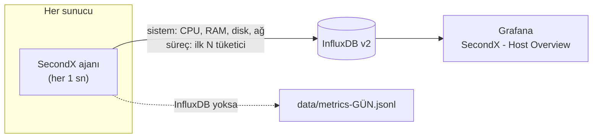

# SecondX: High-Precision Infrastructure Telemetry & Monitoring Agent

[](https://www.python.org/)
[](https://www.influxdata.com/)
[](https://grafana.com/)
[](#-kurulum)
[](LICENSE)

**SecondX**, sunucuları **saniyelik doğrulukla** izleyen hafif bir izleme ajanıdır. Her saniye CPU, RAM, disk ve ağ kullanımını ölçer. **CPU, RAM, disk okuma ve disk yazmada en çok kaynak tüketen süreçleri** tespit eder. Verileri **InfluxDB**'ye aktarır; **Grafana** panosu hazır gelir.

> Geleneksel izleme araçları (CloudWatch, Datadog, varsayılan Prometheus döngüleri) metrikleri **1-5 dakikalık** ortalamalarla toplar. Birkaç saniyelik CPU kilitlenmeleri, anlık disk patlamaları ve belleği hızla tüketen süreçler bu ortalamaların içinde kaybolur. SecondX bunları **saniyesinde ve süreç adıyla** gösterir.

---

## 📑 İçindekiler

- [Öne çıkanlar](#-öne-çıkanlar)
- [Nasıl çalışır?](#%EF%B8%8F-nasıl-çalışır)
- [1 dakikada deneyin](#-1-dakikada-deneyin)
- [Kurulum](#-kurulum)
  - [A. InfluxDB + Grafana (Docker)](#a-influxdb--grafana-tek-komutla-docker)
  - [B. Windows sunucular](#b-windows-sunucular-servis-olarak)
  - [C. Linux sunucular](#c-linux-sunucular-systemd-servisi)
- [Yapılandırma](#%EF%B8%8F-yapılandırma)
- [Grafana panosu](#-grafana-panosu)
- [Veri şeması](#-veri-şeması)
- [İşletim ve güvenlik](#%EF%B8%8F-i%CC%87%C5%9Fletim-ve-g%C3%BCvenlik)
- [Sorun giderme](#-sorun-giderme)
- [1.x'ten yükseltme](#-1xten-yükseltme)
- [Geliştirme ve testler](#-geliştirme-ve-testler)

---

## ✨ Öne çıkanlar

| | |
| :--- | :--- |
| ⏱️ **Gerçek saniyelik örnekleme** | Windows'ta tüm süreçler tek bir çekirdek çağrısıyla okunur: **~5 ms**. Ajan her saniye düzenli ölçer. |
| 🔝 **En çok tüketenler** | CPU, RAM, disk okuma, disk yazma için ilk N süreç (varsayılan 6). Aynı adlı süreçler toplanır (ör. 30 × `chrome.exe` → tek satır). |
| 🧱 **Veri kaybı yok** | InfluxDB kapansa bile ölçüm durmaz. Noktalar bellekte bekletilir ve bağlantı gelince **orijinal zaman damgalarıyla** yazılır. |
| 🚀 **Toplu yazım** | Her saniyenin tüm noktaları tek istekte gönderilir; ölçüm döngüsü asla ağı beklemez. |
| 🖥️ **Çoklu sunucu** | Her nokta `host` etiketi taşır. Tüm sunucular tek bucket'ta, panoda sunucu seçiciyle izlenir. |
| 📊 **Hazır pano** | `docker compose up -d` → Grafana'da veri kaynağı ve pano otomatik kurulu gelir. |
| 🔐 **Kurumsal kurulum** | Windows: SYSTEM hesabıyla açılışta başlayan görev. Linux: root olmayan kullanıcı + güvenlik sıkılaştırmalı systemd servisi. Token dosyada değil ortam değişkeninde. |
| 🗂️ **InfluxDB'siz mod** | Token girilmezse metrikler günlük JSON-lines dosyalarına yazılır (otomatik saklama süresiyle). |

---

## 🏗️ Nasıl çalışır?



| Ölçülen | Kapsam | Birim |
| :--- | :--- | :--- |
| CPU kullanımı | sistem + süreç başına | % (tüm çekirdeklere göre) |
| RAM kullanımı | sistem (% ve GB) + süreç başına | % |
| Disk okuma / yazma | sistem + süreç başına | KB/s |
| Ağ gönderilen / alınan | sistem | KB/s |

> ℹ️ İşletim sistemleri süreç başına ağ trafiği sayacı sunmaz; ağ bu yüzden sistem genelinde ölçülür.

---

## ⚡ 1 dakikada deneyin

```bash
git clone https://github.com/Proaiml/persecc.git
cd persecc
pip install -r requirements.txt
python SecondX.py --once
```

```
SecondX 2.0.0 | host WEB-01 | interval 1.00s
CPU   7.6%   RAM  77.4% (24.7 GB)   Disk R/W    108.7 /    164.6 KB/s   Net out/in      0.6 /      1.1 KB/s

Top cpu (%):
  1. chrome.exe                                     1.75
  2. python.exe                                     1.48
  ...
Top disk_write (KB/s):
  1. sqlservr.exe                                 870.20
  ...
```

Sürekli çalıştırmak için `python SecondX.py`. InfluxDB token'ı girilmediyse veriler `data/` klasörüne yazılır.

---

## 🚀 Kurulum

### A. InfluxDB + Grafana tek komutla (Docker)

Mevcut bir InfluxDB v2'niz varsa bu adımı atlayın.

```bash
cp .env.example .env        # Windows: copy .env.example .env
# .env içindeki TÜM şifreleri ve INFLUXDB_TOKEN'ı değiştirin
docker compose up -d
```

| Servis | Adres | Giriş |
| :--- | :--- | :--- |
| InfluxDB | http://localhost:8086 | `.env` → `INFLUXDB_ADMIN_USER` / `INFLUXDB_ADMIN_PASSWORD` |
| Grafana | http://localhost:3000 | `.env` → `GRAFANA_ADMIN_USER` / `GRAFANA_ADMIN_PASSWORD` |

Grafana açılışta **SecondX - Host Overview** panosunu gösterir. Veri kaynağı token'ı `.env`'den otomatik alınır.

> 💡 Güçlü bir token üretmek için: `python -c "import secrets; print(secrets.token_urlsafe(48))"`

### B. Windows sunucular (servis olarak)

**Yönetici** olarak açılmış PowerShell'de, SecondX klasörünün içinde:

```powershell
powershell -ExecutionPolicy Bypass -File .\install_windows.ps1 -InfluxToken "<INFLUXDB_TOKEN>"
```

Betik şunları yapar:

1. Klasörün içinde özel bir Python ortamı (`.venv`) kurar ve bağımlılıkları yükler.
2. Token'ı makine düzeyinde `SECONDX_INFLUX_TOKEN` ortam değişkenine yazar (config dosyasına yazılmaz).
3. `--check` ile yapılandırmayı ve InfluxDB bağlantısını doğrular.
4. **SecondX** adlı zamanlanmış görevi oluşturur: bilgisayar açılınca SYSTEM hesabıyla başlar, çökerse 1 dakikada yeniden başlar, süre sınırı yoktur.

| İşlem | Komut |
| :--- | :--- |
| Durum | `Get-ScheduledTask -TaskName SecondX \| Get-ScheduledTaskInfo` |
| Günlük | `Get-Content .\logs\secondx.log -Tail 50 -Wait` |
| Durdur / başlat | `Stop-ScheduledTask SecondX` / `Start-ScheduledTask SecondX` |
| Kaldır | `powershell -ExecutionPolicy Bypass -File .\uninstall_windows.ps1 -RemoveToken` |

Servis kurmadan elle çalıştırmak için `run_agent.bat` dosyasına çift tıklayın.

### C. Linux sunucular (systemd servisi)

```bash
sudo ./install_linux.sh --token "<INFLUXDB_TOKEN>"
```

Betik şunları yapar:

1. `secondx` adlı, oturum açamayan bir **sistem kullanıcısı** oluşturur. Ajan root olarak **çalışmaz**.
2. Dosyaları `/opt/secondx` altına kopyalar ve özel bir `venv` kurar. Mevcut `config.json` korunur, güncellemede üzerine yazılmaz.
3. Token'ı `/etc/secondx/secondx.env` dosyasına yazar (izin `600`, yalnızca root okur).
4. `secondx.service`'i kurup başlatır.

Servis, tüm süreçlerin disk sayaçlarını okuyabilmek için yalnızca `CAP_SYS_PTRACE` ve `CAP_DAC_READ_SEARCH` yetkilerini alır. `ProtectSystem=strict`, `ProtectHome`, `NoNewPrivileges` ve `PrivateTmp` ile sıkılaştırılmıştır.

| İşlem | Komut |
| :--- | :--- |
| Durum | `systemctl status secondx` |
| Canlı günlük | `journalctl -u secondx -f` |
| Yapılandırma | `sudo nano /opt/secondx/config.json && sudo systemctl restart secondx` |
| Güncelleme | `git pull && sudo ./install_linux.sh` |
| Kaldırma | `sudo systemctl disable --now secondx && sudo rm -rf /opt/secondx /etc/secondx /etc/systemd/system/secondx.service` |

---

## ⚙️ Yapılandırma

`config.json` (değiştirmediğiniz ayarlar varsayılanla çalışır):

```json
{
  "interval_seconds": 1,
  "top_n": 6,
  "exclude_processes": ["System Idle Process", "Idle", "MemCompression", "Memory Compression", "Secure System", "Registry", "System"],
  "host": "",
  "log_dir": "logs",
  "log_retention_days": 14,
  "log_level": "INFO",
  "influx": {
    "enabled": true,
    "url": "http://localhost:8086",
    "token": "",
    "org": "secondx",
    "bucket": "secondx",
    "timeout_ms": 5000,
    "max_buffer_points": 200000
  },
  "local_output": { "enabled": "auto", "dir": "data", "retention_days": 14 }
}
```

| Ayar | Varsayılan | Açıklama |
| :--- | :---: | :--- |
| `interval_seconds` | `1` | Örnekleme aralığı (0.2 - 3600 sn) |
| `top_n` | `6` | Her metrikte raporlanacak süreç sayısı |
| `exclude_processes` | *(liste)* | Sıralamaya alınmayacak süreç adları (büyük/küçük harf duyarsız) |
| `host` | bilgisayar adı | Sunucu etiketi (panoda görünen ad) |
| `log_dir`, `log_retention_days` | `logs`, `14` | Günlük dosyası (`secondx.log`, gece yarısı döner) ve saklama süresi |
| `log_level` | `INFO` | `DEBUG` her örneği yazar |
| `influx.*` | | InfluxDB v2 bağlantısı. `token` boşsa InfluxDB kullanılmaz |
| `influx.max_buffer_points` | `200000` | InfluxDB'ye ulaşılamazken bellekte tutulacak nokta sayısı (1 sn aralık ve top 6 ile ≈ 2 saat) |
| `local_output.enabled` | `auto` | Token yoksa `data/metrics-GÜN.jsonl` dosyalarına yaz |

**Ortam değişkenleri** config dosyasını geçersiz kılar. Token'ı dosyada tutmamak için önerilen yol budur:

| Değişken | Karşılığı |
| :--- | :--- |
| `SECONDX_INFLUX_TOKEN` | `influx.token` |
| `SECONDX_INFLUX_URL` / `_ORG` / `_BUCKET` | `influx.url` / `org` / `bucket` |
| `SECONDX_HOST` | `host` |
| `SECONDX_INTERVAL` | `interval_seconds` |
| `SECONDX_CONFIG` | config dosyasının yolu |

**Komut satırı:**

```text
python SecondX.py              ajanı çalıştır
python SecondX.py --once       tek örnek al, tablo olarak yazdır, çık
python SecondX.py --check      config + InfluxDB bağlantısı ve yazma iznini test et
python SecondX.py --dry-run    ölç ama hiçbir yere yazma
python SecondX.py --verbose    ayrıntılı günlük
python SecondX.py --config /yol/config.json
```

---

## 📊 Grafana panosu

`grafana/dashboards/secondx.json` (Docker kurulumunda otomatik yüklenir; mevcut Grafana'ya **Dashboards → Import** ile eklenebilir).

| Bölüm | İçerik |
| :--- | :--- |
| Üst satır | Anlık CPU, RAM, disk yazma, ağ giriş (eşik renkli) |
| Sistem | CPU & RAM %, disk ve ağ KB/s zaman grafikleri |
| Süreçler | CPU, RAM, disk okuma, disk yazma için en çok tüketenler (süreç adıyla) |
| Tablo | Seçili zaman aralığında süreç başına ortalama tüketim |

Üstteki **Host** seçicisi bir veya birden fazla sunucuyu seçer. **Bucket** kutusu farklı bir bucket adı kullanıyorsanız değiştirilir. Pano 5 saniyede bir yenilenir.

---

## 🧬 Veri şeması

**`secondx_system`**: her örnekte bir nokta

| Etiket | Alanlar |
| :--- | :--- |
| `host` | `cpu_percent`, `ram_percent`, `ram_used_gb`, `process_count`, `disk_read_kbps`, `disk_write_kbps`, `net_sent_kbps`, `net_recv_kbps` |

**`secondx_process`**: her örnekte, her metrik için ilk N süreç

| Etiketler | Alan |
| :--- | :--- |
| `host`, `metric` (`cpu` \| `ram` \| `disk_read` \| `disk_write`), `process`, `rank` (1..N) | `value` (float) |

Örnek Flux sorgusu, son 5 dakikada en çok disk yazan süreçler:

```flux
from(bucket: "secondx")
  |> range(start: -5m)
  |> filter(fn: (r) => r._measurement == "secondx_process" and r.metric == "disk_write")
  |> group(columns: ["process"])
  |> mean()
  |> group()
  |> sort(columns: ["_value"], desc: true)
```

---

## 🛡️ İşletim ve güvenlik

- **Kaynak kullanımı:** bir örnek Windows'ta ~5-40 ms, Linux'ta birkaç ms CPU harcar. Bellek kullanımı sabittir (tampon sınırlıdır).
- **Kesinti davranışı:** InfluxDB kapalıyken noktalar bekletilir ve 1 → 60 sn aralıklarla yeniden denenir. Bağlantı gelince boşluksuz yazılır. Tampon dolarsa en eski noktalar atılır ve günlüğe yazılır.
- **Durum satırı:** ajan 5 dakikada bir özet yazar: örnek sayısı, yavaş turlar, hatalar, gönderilen/bekleyen/atılan nokta.
- **Hata dayanıklılığı:** tek bir hatalı tur ajanı durdurmaz. Beklenmedik bir çökme nedeniyle birlikte günlüğe yazılır ve servis yöneticisi ajanı yeniden başlatır.
- **Düzgün kapanma:** SIGTERM / Ctrl+C / servis durdurma → bekleyen noktalar gönderilir (en fazla 5 sn), sonra kapanır.
- **Sırlar:** `.env`, `token.json`, `secondx.env`, `logs/` ve `data/` git'e alınmaz (`.gitignore`). Token'ı ortam değişkeniyle verin.
- **InfluxDB yetkisi:** üretimde ajan için yalnızca ilgili bucket'a **yazma** yetkisi olan ayrı bir token oluşturun (Influx UI → API Tokens → Custom).

---

## 🛠 Sorun giderme

| Belirti | Çözüm |
| :--- | :--- |
| `--check` → **NOT reachable** | URL doğru mu? Güvenlik duvarı 8086'ya izin veriyor mu? Docker: `docker compose ps` |
| `--check` → **write failed** | Token'ın bucket'a yazma yetkisi, `org` ve `bucket` adları |
| Günlükte **'influxdb-client' package is not installed** | Ajanı çalıştıran Python için: `<python> -m pip install -r requirements.txt`. Bu sırada veriler `data/`'ya yazılır, kaybolmaz |
| Linux'ta başka kullanıcıların süreçleri disk listelerinde görünmüyor | Ajanı `secondx.service` ile çalıştırın (gerekli yetkiler orada tanımlı); elle çalıştırıyorsanız `sudo` kullanın |
| Panoda **No data** | Pano üstündeki Bucket adı doğru mu? Host seçili mi? Zaman aralığı son 15 dk mı? |
| `ERROR: config.json: invalid JSON at line N` | Belirtilen satırda eksik tırnak veya fazla virgül |

---

## 🔁 1.x'ten yükseltme

- `config.json` içindeki `wait_time` hâlâ okunur (`interval_seconds` olarak).
- `token.json` hâlâ okunur, ancak değerleri `config.json` → `influx` bölümüne ya da ortam değişkenlerine taşıyın.
- Veri şeması değişti: `Custom_scripts` / `EX134*` alanlarının yerine [`secondx_system` ve `secondx_process`](#-veri-şeması) geldi. Eski panolar yeni ölçümlere göre güncellenmeli. Hazır pano yeni şemayı kullanır.
- `influx_exporter.influx_creator(...)` fonksiyonu eski betikler için korunmuştur.

Ayrıntılar: [CHANGELOG.md](CHANGELOG.md)

---

## 🧪 Geliştirme ve testler

```bash
python -m unittest discover -s tests -v
```

```
persecc/
├── SecondX.py            # Ajan: yapılandırma, ana döngü, komut satırı
├── collector.py          # Ölçüm: sistem ve süreç metrikleri, hız hesapları
├── win_snapshot.py       # Windows hızlı süreç listesi (NtQuerySystemInformation)
├── lissozis.py           # Sıralama: en çok tüketen N süreç
├── influx_exporter.py    # Aktarım: toplu, bloklamayan, yeniden deneyen yazıcı + yerel dosya
├── config.json           # Ajan ayarları (sır içermez)
├── requirements.txt
├── run_agent.bat                 # Windows: elle çalıştırma
├── install_windows.ps1           # Windows: servis kurulumu
├── uninstall_windows.ps1
├── install_linux.sh              # Linux: servis kurulumu
├── secondx.service               # systemd birimi
├── secondx.env.example           # Linux token dosyası şablonu
├── docker-compose.yml            # InfluxDB + Grafana
├── .env.example                  # Docker şifre/token şablonu
├── grafana/                      # Hazır veri kaynağı ve pano
└── tests/
```

---

## 👨‍💻 Yazar

- **İlhan Koçaslan** — [GitHub: @Proaiml](https://github.com/Proaiml)

Lisans: [MIT](LICENSE)
