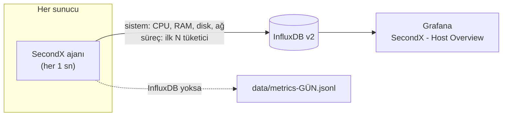
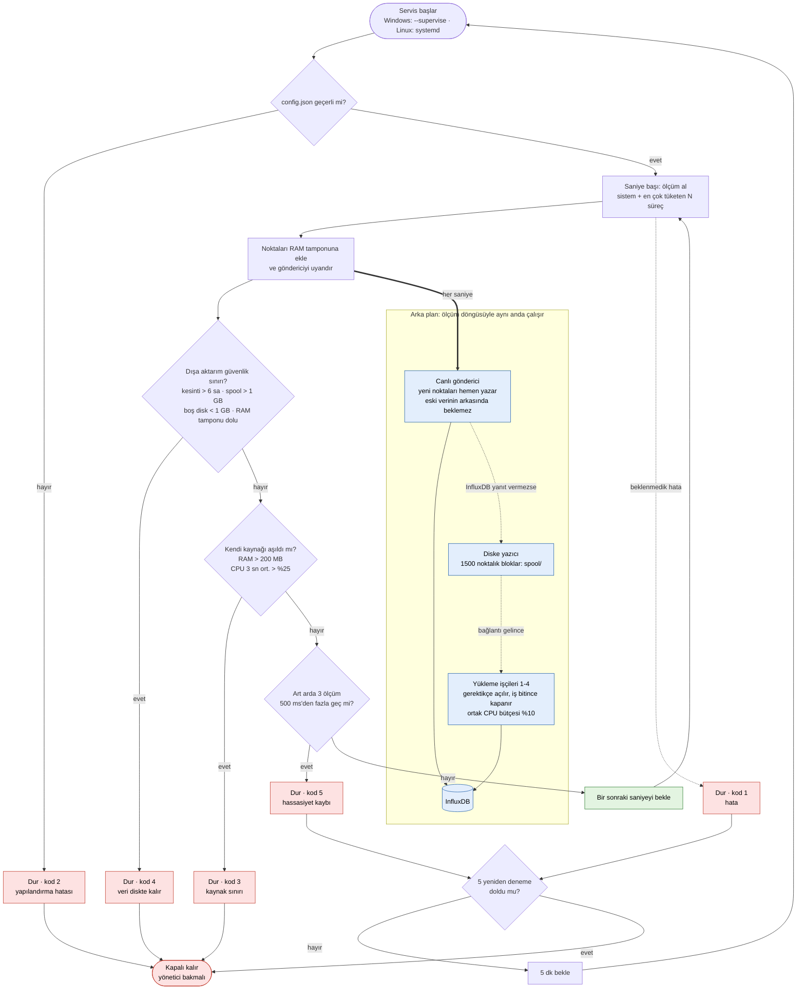
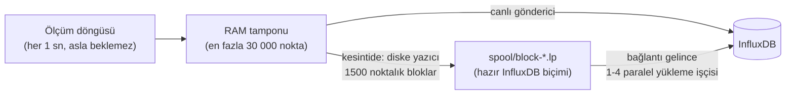

# SecondX: High-Precision Infrastructure Telemetry & Monitoring Agent

[](https://www.python.org/)
[](https://www.influxdata.com/)
[](https://grafana.com/)
[](#-kurulum)
[](LICENSE)

**SecondX**, sunucuları **saniyelik doğrulukla** izleyen hafif bir izleme ajanıdır. Her saniye CPU, RAM, disk ve ağ kullanımını ölçer. **CPU, RAM, disk okuma ve disk yazmada en çok kaynak tüketen süreçleri** tespit eder. Verileri **InfluxDB**'ye aktarır; **Grafana** panosu hazır gelir.

> Geleneksel izleme araçları (CloudWatch, Datadog, varsayılan Prometheus döngüleri) metrikleri **1-5 dakikalık** ortalamalarla toplar. Birkaç saniyelik CPU kilitlenmeleri, anlık disk patlamaları ve belleği hızla tüketen süreçler bu ortalamaların içinde kaybolur. SecondX bunları **saniyesinde ve süreç adıyla** gösterir.

> 🔒 **Temel ilke: izlenen sunucuya asla yük olmamak.** SecondX önemli sunucularda çalışacak şekilde tasarlandı. Kendisine ayrılan CPU veya RAM sınırını aştığı **anda durur**. Saniyelik hassasiyeti kaybederse durur. InfluxDB uzun süre kapalı kalırsa belleği şişirmez: veriyi diske bloklar halinde yazar ve belirlenen sınırlar aşılırsa durur. Ayrıntılar: [Sıkı mod](#-sıkı-mod-kritik-sunucular-için).

---

## 📑 İçindekiler

- [Öne çıkanlar](#-öne-çıkanlar)
- [Nasıl çalışır?](#%EF%B8%8F-nasıl-çalışır)
- [1 dakikada deneyin](#-1-dakikada-deneyin)
- [Kurulum](#-kurulum)
  - [A. InfluxDB + Grafana (Docker)](#a-influxdb--grafana-tek-komutla-docker)
  - [B. Windows sunucular](#b-windows-sunucular-servis-olarak)
  - [C. Linux sunucular](#c-linux-sunucular-systemd-servisi)
- [Sıkı mod (kritik sunucular için)](#-sıkı-mod-kritik-sunucular-için)
- [Yapılandırma](#%EF%B8%8F-yapılandırma)
- [Grafana panosu](#-grafana-panosu)
- [Veri şeması](#-veri-şeması)
- [İşletim ve güvenlik](#%EF%B8%8F-i%CC%87%C5%9Fletim-ve-g%C3%BCvenlik)
- [Sorun giderme](#-sorun-giderme)
- [1.x'ten yükseltme](#-1xten-yükseltme)
- [Geliştirme ve testler](#-geliştirme-ve-testler)

---

## ✨ Öne çıkanlar

| | |
| :--- | :--- |
| ⏱️ **Gerçek saniyelik örnekleme** | Windows'ta tüm süreçler tek bir çekirdek çağrısıyla okunur: **~5 ms**. Ajan her saniye düzenli ölçer. |
| 🔝 **En çok tüketenler** | CPU, RAM, disk okuma, disk yazma için ilk N süreç (varsayılan 6). Aynı adlı süreçler toplanır (ör. 30 × `chrome.exe` → tek satır). |
| 🛑 **Sorun çıkarsa anında durur** | Kendi CPU/RAM sınırı, saniyelik hassasiyet ve dışa aktarım güvenlik sınırları sürekli denetlenir. Sınır aşılırsa ajan ~1 sn içinde durur ve nedeni günlüğe yazar. |
| 🧱 **Veri kaybı yok, RAM şişmez** | InfluxDB kapansa bile ölçüm durmaz. Veri bellekte küçük bir tamponda, taşarsa **ayrı bir iş parçacığında diske bloklar halinde** bekletilir. Bağlantı gelince **orijinal zaman damgalarıyla** yazılır. |
| 🔁 **Kontrollü yeniden başlatma** | Geçici hatalarda 5 dk arayla en fazla 5 deneme. Kaynak sınırı aşımında **asla** kendiliğinden yeniden başlamaz. |
| 🚀 **Toplu yazım** | Her saniyenin tüm noktaları tek istekte gönderilir; ölçüm döngüsü asla ağı beklemez. |
| 🖥️ **Çoklu sunucu** | Her nokta `host` etiketi taşır. Tüm sunucular tek bucket'ta, panoda sunucu seçiciyle izlenir. |
| 📊 **Hazır pano** | `docker compose up -d` → Grafana'da veri kaynağı ve pano otomatik kurulu gelir. |
| 🔐 **Kurumsal kurulum** | Windows: SYSTEM hesabıyla açılışta başlayan görev. Linux: root olmayan kullanıcı + güvenlik sıkılaştırmalı systemd servisi. Token dosyada değil ortam değişkeninde. |
| 🗂️ **InfluxDB'siz mod** | Token girilmezse metrikler günlük JSON-lines dosyalarına yazılır (otomatik saklama süresiyle). |

---

## 🏗️ Nasıl çalışır?



| Ölçülen | Kapsam | Birim |
| :--- | :--- | :--- |
| CPU kullanımı | sistem + süreç başına | % (tüm çekirdeklere göre) |
| RAM kullanımı | sistem (% ve GB) + süreç başına | % |
| Disk okuma / yazma | sistem + süreç başına | KB/s |
| Ağ gönderilen / alınan | sistem | KB/s |

> ℹ️ İşletim sistemleri süreç başına ağ trafiği sayacı sunmaz; ağ bu yüzden sistem genelinde ölçülür.

### Akış diyagramı: her saniye ne olur?



Ölçüm döngüsü InfluxDB'ye kendisi yazmaz: noktaları RAM tamponuna koyar ve **aynı anda çalışan** canlı göndericiyi uyandırır. Canlı gönderici noktaları hemen (normalde milisaniyeler içinde, bir sonraki saniye gelmeden) InfluxDB'ye yazar. Böylece InfluxDB yavaşlasa, donsa ya da kapansa bile ölçüm döngüsü hiç beklemez ve saniyelik ritim bozulmaz. Kesintiden kalan veriyi ayrı yükleme işçileri gönderir; canlı veri onların arkasında sıraya girmez. Mavi kutular bu arka plan işidir. Kırmızı kutular ajanın durduğu noktalardır. Kod 1 ve 5 geçici sorunlardır: 5 dk arayla en fazla 5 kez yeniden denenir. Kod 2, 3 ve 4 bir yöneticinin bakmasını gerektirir: ajan kendiliğinden yeniden başlamaz. Ayrıntılar: [Sıkı mod](#-sıkı-mod-kritik-sunucular-için).

---

## ⚡ 1 dakikada deneyin

```bash
git clone https://github.com/Proaiml/persecc.git
cd persecc
pip install -r requirements.txt
python SecondX.py --once
```

```
SecondX 2.2.0 | host WEB-01 | interval 1.00s
CPU   7.6%   RAM  77.4% (24.7 GB)   Disk R/W    108.7 /    164.6 KB/s   Net out/in      0.6 /      1.1 KB/s

Top cpu (%):
  1. chrome.exe                                     1.75
  2. python.exe                                     1.48
  ...
Top disk_write (KB/s):
  1. sqlservr.exe                                 870.20
  ...
```

Sürekli çalıştırmak için `python SecondX.py`. InfluxDB token'ı girilmediyse veriler `data/` klasörüne yazılır.

---

## 🚀 Kurulum

### A. InfluxDB + Grafana tek komutla (Docker)

Mevcut bir InfluxDB v2'niz varsa bu adımı atlayın.

```bash
cp .env.example .env        # Windows: copy .env.example .env
# .env içindeki TÜM şifreleri ve INFLUXDB_TOKEN'ı değiştirin
docker compose up -d
```

| Servis | Adres | Giriş |
| :--- | :--- | :--- |
| InfluxDB | http://localhost:8086 | `.env` → `INFLUXDB_ADMIN_USER` / `INFLUXDB_ADMIN_PASSWORD` |
| Grafana | http://localhost:3000 | `.env` → `GRAFANA_ADMIN_USER` / `GRAFANA_ADMIN_PASSWORD` |

Grafana açılışta **SecondX - Host Overview** panosunu gösterir. Veri kaynağı token'ı `.env`'den otomatik alınır.

> 💡 Güçlü bir token üretmek için: `python -c "import secrets; print(secrets.token_urlsafe(48))"`

### B. Windows sunucular (servis olarak)

**Yönetici** olarak açılmış PowerShell'de, SecondX klasörünün içinde:

```powershell
powershell -ExecutionPolicy Bypass -File .\install_windows.ps1 -InfluxToken "<INFLUXDB_TOKEN>"
```

Betik şunları yapar:

1. Klasörün içinde özel bir Python ortamı (`.venv`) kurar ve bağımlılıkları yükler.
2. Token'ı makine düzeyinde `SECONDX_INFLUX_TOKEN` ortam değişkenine yazar (config dosyasına yazılmaz).
3. `--check` ile yapılandırmayı ve InfluxDB bağlantısını doğrular.
4. **SecondX** adlı zamanlanmış görevi oluşturur: bilgisayar açılınca SYSTEM hesabıyla, `--supervise` (gözetmen) modunda başlar. Yeniden başlatma politikasını gözetmen uygular (bkz. [Sıkı mod](#-sıkı-mod-kritik-sunucular-için)). Süre sınırı yoktur.

| İşlem | Komut |
| :--- | :--- |
| Durum | `Get-ScheduledTask -TaskName SecondX \| Get-ScheduledTaskInfo` |
| Günlük | `Get-Content .\logs\secondx.log -Tail 50 -Wait` |
| Durdur / başlat | `Stop-ScheduledTask SecondX` / `Start-ScheduledTask SecondX` |
| Kaldır | `powershell -ExecutionPolicy Bypass -File .\uninstall_windows.ps1 -RemoveToken` |

Servis kurmadan elle çalıştırmak için `run_agent.bat` dosyasına çift tıklayın.

### C. Linux sunucular (systemd servisi)

```bash
sudo ./install_linux.sh --token "<INFLUXDB_TOKEN>"
```

Betik şunları yapar:

1. `secondx` adlı, oturum açamayan bir **sistem kullanıcısı** oluşturur. Ajan root olarak **çalışmaz**.
2. Dosyaları `/opt/secondx` altına kopyalar ve özel bir `venv` kurar. Mevcut `config.json` korunur, güncellemede üzerine yazılmaz.
3. Token'ı `/etc/secondx/secondx.env` dosyasına yazar (izin `600`, yalnızca root okur).
4. `secondx.service`'i kurup başlatır.

Servis, tüm süreçlerin disk sayaçlarını okuyabilmek için yalnızca `CAP_SYS_PTRACE` ve `CAP_DAC_READ_SEARCH` yetkilerini alır. `ProtectSystem=strict`, `ProtectHome`, `NoNewPrivileges` ve `PrivateTmp` ile sıkılaştırılmıştır.

Yeniden başlatma politikasını systemd uygular: hata (1) ve hassasiyet kaybında (5) 5 dk arayla, 2 saat içinde en fazla 5 kez. Çıkış kodu 2, 3 ve 4'te **yeniden başlatmaz** (`RestartPreventExitStatus`). Ayrıca çekirdek düzeyinde ikinci bir emniyet vardır: `MemoryMax=400M`, `CPUQuota=50%`. Bunlar ajanın kendi sınırlarının (200 MB, %25) üstündedir; ajanın kendi denetimi hiç çalışmasa bile sunucu korunur.

| İşlem | Komut |
| :--- | :--- |
| Durum | `systemctl status secondx` (durduysa `status=N` çıkış kodunu gösterir) |
| Canlı günlük | `journalctl -u secondx -f` |
| Yapılandırma | `sudo nano /opt/secondx/config.json && sudo systemctl restart secondx` |
| Güncelleme | `git pull && sudo ./install_linux.sh` |
| Kaldırma | `sudo systemctl disable --now secondx && sudo rm -rf /opt/secondx /etc/secondx /etc/systemd/system/secondx.service` |

---

## 🔒 Sıkı mod (kritik sunucular için)

`strict_mode: true` varsayılandır. Amaç şudur: izleme ajanını üretim sunucusuna **korkmadan** koyabilmek. Ajan ya saniyelik hassasiyetle sorunsuz çalışır ya da **hemen durur**. Arada bir durum yoktur: yavaşlayan, belleği şişen, sunucuyu yoran bir ajan olmaz.

### Anında durduran denetimler

| Denetim | Varsayılan | Ne zaman durur? | Çıkış kodu |
| :--- | :--- | :--- | :---: |
| **Kendi RAM'i** | `limits.max_memory_mb: 200` | Her saniye ölçülür; sınır aşıldığı **ilk örnekte** | `3` |
| **Kendi CPU'su** | `limits.max_cpu_percent: 25` (tek çekirdeğin %'si) | Son `cpu_window_seconds` (3 sn) ortalaması sınırı aşınca. İlk 5 sn (Python'un açılışı) ısınma sayılır | `3` |
| **Saniyelik hassasiyet** | `precision.max_missed_slots: 3`, `slot_tolerance_ms: 500` | Art arda 3 örnek zamanını 500 ms'den fazla kaçırırsa. Saat atlaması (>30 sn, ör. uyku / NTP) durdurmaz, yeniden hizalar | `5` |
| **InfluxDB kesintisi** | `influx.max_outage_hours: 6` | InfluxDB 6 saatten uzun süre yazılamazsa | `4` |
| **Disk tamponu boyutu** | `influx.max_spool_mb: 1024` | Diskteki bekleyen veri 1 GB'ı geçerse | `4` |
| **Boş disk alanı** | `influx.min_free_disk_mb: 1024` | Diskte 1 GB'tan az yer kalırsa (sunucunun diskini doldurmaz) | `4` |
| **RAM tamponu** | `influx.max_memory_points: 30000` | Disk tamponu yetişemez / yazılamazsa (veri **sessizce atılmaz**) | `4` |
| **Beklenmedik hata** | | Bir ölçüm turu hata verirse | `1` |

Durunca günlüğe tek satırlık, açık bir neden yazılır:

```
CRITICAL secondx: STOPPING: own memory 212 MB exceeds limit 200 MB (exit code 3 = own CPU/RAM limit exceeded).
```

### Çıkış kodları ve yeniden başlatma

| Kod | Anlamı | Yeniden başlatılır mı? |
| :---: | :--- | :--- |
| `0` | İstenerek durduruldu | Hayır |
| `1` | Beklenmedik hata | **Evet**: 5 dk arayla en fazla 5 kez |
| `2` | Yapılandırma hatası | Hayır (önce config düzeltilmeli) |
| `3` | Kendi CPU/RAM sınırı aşıldı | **Asla**: bir yönetici bakmalı |
| `4` | Dışa aktarım güvenlik sınırı (kesinti / disk) | **Asla**: bir yönetici bakmalı |
| `5` | Saniyelik hassasiyet kayboldu (sunucu aşırı yüklü) | **Evet**: 5 dk arayla en fazla 5 kez |

Politika `config.json` → `restart` bölümündedir: `max_attempts: 5`, `delay_seconds: 300`. Ajan `reset_after_seconds` (1 saat) boyunca sorunsuz çalışırsa deneme sayacı sıfırlanır. 5 deneme de başarısız olursa ajan kapalı kalır.

- **Windows:** görev `SecondX.py --supervise` ile çalışır. Gözetmen, ajanı ayrı bir süreç olarak başlatır ve politikayı uygular. Gözetmen öldürülürse (ör. Görev Zamanlayıcı → *Sonlandır*) ajan da ~1 sn içinde kendiliğinden kapanır; sahipsiz süreç kalmaz. Gözetmen günlüğü: `logs/secondx-supervisor.log`.
- **Linux:** aynı politikayı `secondx.service` içinde systemd uygular.

### InfluxDB kesintisinde veri nasıl bekletilir?



1. Ölçüm döngüsü noktaları yalnızca RAM tamponuna ekler; ağı ya da diski **hiç** beklemez. Saniyelik ritim bu yüzden bozulmaz.
2. InfluxDB yanıt vermezse **ayrı bir iş parçacığı** en eski noktaları 1500'lük bloklar halinde diske yazar (`fsync` + atomik ad değiştirme; yarım kalmış blok olmaz). Bloklar doğrudan InfluxDB'nin satır biçimindedir: gönderirken dönüştürme gerekmez (blok başına CPU 6.6 ms → ~0). RAM kullanımı sabit kalır: testte 45 sn kesintide ajan 60 MB'ta kaldı.
3. Bağlantı gelince **canlı veri hemen** gönderilir; diskteki birikmiş bloklar onu bekletmez. Birikmiş blokları ayrı **yükleme işçileri** gönderir, hepsi **orijinal zaman damgalarıyla**. Panoda boşluk kalmaz.
4. Yükleme işçileri gerektikçe açılır: gönderim süresinin çoğu sunucunun yanıtını beklemekle geçiyorsa (uzak InfluxDB), saniyede bir işçi eklenir, en fazla `backlog_max_workers` (4). Beklerken Python kilidi (GIL) serbest kalır; paralellik ölçüm döngüsünden zaman çalmaz. İş bitince işçiler kapanır. Hepsi **tek bir ortak CPU bütçesi** (`backlog_cpu_percent: 10`) içinde kalır.
5. InfluxDB'nin kesin olarak reddettiği bir blok (HTTP 400) `*.rejected`, okunamayan bir blok `*.bad` olarak kenara alınır ve incelemeye bırakılır. Kuyruk tek bir bozuk blok yüzünden takılmaz.
6. Ajan kesinti sırasında durdurulursa (servis durdurma, yeniden başlatma) RAM'deki noktalar ve o an yazılmakta olan paket de diske yazılır ve bir sonraki açılışta gönderilir. Aynı noktanın iki kez yazılması InfluxDB'de zararsızdır (üzerine yazar); kaybolması ise kabul edilemez.

**Gönderici her zaman canlı mı?** Ölçüm döngüsü her saniye arka plan iş parçacıklarını da denetler. Biri çökerse ya da tek bir yazma işlemi 30 sn'den uzun asılı kalırsa (normalde `timeout_ms` = 5 sn ile sınırlı) ajan kod 1 ile durur ve 5 dk sonra temiz bir bağlantıyla yeniden başlatılır. InfluxDB bağlantısı açık tutulur (keep-alive havuzu): her saniye yeniden bağlantı kurma gecikmesi olmaz. Durum satırı 5 dakikada bir en kötü teslim gecikmesini de yazar (`max delay ... ms`).

### Ölçülen ayak izi (Windows 11, gerçek InfluxDB 2.7)

| Senaryo | Sonuç |
| :--- | :--- |
| Normal çalışma | CPU ortalama **%1.8**, en yüksek %4.7 (tek çekirdeğin %'si) · RAM **59 MB** |
| 45 sn InfluxDB kesintisi | 3 blok diske yazıldı · RAM en yüksek 60 MB · kesinti sonrası **boşluksuz** toparlandı |
| Kesinti sınırı aşıldı | Ajan kendiliğinden durdu (kod 4) · bekleyen veri diskte kaldı, yeniden başlayınca gönderildi |
| InfluxDB 60 sn **dondu** (bağlantı açık, yanıt yok) | Ölçüm hiç aksamadı: 112 sn'de 112 örnek, aralık 979-1016 ms · veri diske gitti, çözülünce eksiksiz yüklendi |
| 6 saatlik birikmiş veri (540 000 nokta) | **6.4 sn**'de yüklendi (2.1'de 110 sn) · RAM 62 MB |
| 24 saatlik birikmiş veri (2 160 000 nokta) | 1 işçi 46.5 sn, 4 işçi **33.2 sn** · CPU ortalama %13.5, 3 sn en yüksek %16.9 (sınır 25) · yükleme sırasında canlı veri en fazla 1 sn geride · ölçüm ritmi 1000 ms'den en fazla 19 ms saptı, **eksik saniye yok** |
| RAM sınırı 50 MB'a düşürüldü | Ajan **1.2 sn** içinde durdu (kod 3) · gözetmen yeniden başlatmadı |
| Gözetmen sert biçimde öldürüldü | Ajan 1.2 sn içinde kendiliğinden kapandı |

> ℹ️ Testteki InfluxDB aynı bilgisayarda çalıştığı için yükleme hızını sunucunun kendi yazma hızı sınırlar. Ağ gecikmesi olan uzak bir InfluxDB'de paralel işçilerin kazancı daha büyüktür.

> ℹ️ `strict_mode: false` yapılırsa ajan hatalarda durmaz, günlüğe yazıp devam eder ve geride kalırsa sessizce yeniden hizalanır. Diske bekletme ve güvenlik sınırları bu modda da geçerlidir. Kritik sunucular için önerilmez.

---

## ⚙️ Yapılandırma

`config.json` (değiştirmediğiniz ayarlar varsayılanla çalışır):

```json
{
  "interval_seconds": 1,
  "top_n": 6,
  "exclude_processes": ["System Idle Process", "Idle", "MemCompression", "Memory Compression", "Secure System", "Registry", "System"],
  "host": "",
  "log_dir": "logs",
  "log_retention_days": 14,
  "log_level": "INFO",
  "strict_mode": true,
  "limits":    { "max_cpu_percent": 25, "max_memory_mb": 200, "cpu_window_seconds": 3 },
  "precision": { "max_missed_slots": 3, "slot_tolerance_ms": 500 },
  "restart":   { "max_attempts": 5, "delay_seconds": 300, "reset_after_seconds": 3600 },
  "influx": {
    "enabled": true,
    "url": "http://localhost:8086",
    "token": "",
    "org": "secondx",
    "bucket": "secondx",
    "timeout_ms": 5000,
    "max_memory_points": 30000,
    "spool_dir": "spool",
    "spool_block_points": 1500,
    "max_outage_hours": 6,
    "max_spool_mb": 1024,
    "min_free_disk_mb": 1024,
    "backlog_cpu_percent": 10,
    "backlog_max_workers": 4
  },
  "local_output": { "enabled": "auto", "dir": "data", "retention_days": 14 }
}
```

| Ayar | Varsayılan | Açıklama |
| :--- | :---: | :--- |
| `interval_seconds` | `1` | Örnekleme aralığı (0.2 - 3600 sn) |
| `top_n` | `6` | Her metrikte raporlanacak süreç sayısı |
| `exclude_processes` | *(liste)* | Sıralamaya alınmayacak süreç adları (büyük/küçük harf duyarsız) |
| `host` | bilgisayar adı | Sunucu etiketi (panoda görünen ad) |
| `log_dir`, `log_retention_days` | `logs`, `14` | Günlük dosyası (`secondx.log`, gece yarısı döner) ve saklama süresi |
| `log_level` | `INFO` | `DEBUG` her örneği yazar |
| `influx.*` | | InfluxDB v2 bağlantısı. `token` boşsa InfluxDB kullanılmaz |
| `strict_mode` | `true` | Sorun çıkınca anında dur (bkz. [Sıkı mod](#-sıkı-mod-kritik-sunucular-için)) |
| `limits.max_cpu_percent` | `25` | Ajanın kendi CPU sınırı, **tek çekirdeğin** %'si olarak |
| `limits.max_memory_mb` | `200` | Ajanın kendi RAM (RSS) sınırı, MB |
| `limits.cpu_window_seconds` | `3` | CPU sınırının ortalandığı pencere (kısa anlık sıçramalar durdurmaz) |
| `precision.max_missed_slots` | `3` | Art arda kaçırılabilecek örnek sayısı |
| `precision.slot_tolerance_ms` | `500` | Bir örneğin "kaçırıldı" sayılması için gecikme |
| `restart.max_attempts` / `delay_seconds` / `reset_after_seconds` | `5` / `300` / `3600` | Gözetmenin yeniden başlatma politikası (Windows `--supervise`) |
| `influx.max_memory_points` | `30000` | RAM tamponu. Yarısı dolunca diske yazmaya başlanır, tamamı dolarsa ajan durur |
| `influx.spool_dir` | `spool` | Kesintide blokların yazılacağı klasör (boş = diske yazma yok) |
| `influx.spool_block_points` | `1500` | Bir bloktaki nokta sayısı (1 sn, top 6 ile ≈ 1 dakikalık veri) |
| `influx.max_outage_hours` | `6` | Bu süreden uzun kesintide ajan durur (kod 4) |
| `influx.max_spool_mb` | `1024` | Diskteki bekleyen verinin üst sınırı |
| `influx.min_free_disk_mb` | `1024` | Diskte en az bu kadar boş yer bırakılır |
| `influx.backlog_cpu_percent` | `10` | Birikmiş veri yüklenirken tüm yükleme işçilerinin **toplam** CPU bütçesi (tek çekirdeğin %'si). `max_cpu_percent`'in yarısını geçemez |
| `influx.backlog_max_workers` | `4` | Birikmiş veri için en fazla paralel yükleme işçisi (1-16). Gerektikçe açılır, iş bitince kapanır |
| `local_output.enabled` | `auto` | Token yoksa `data/metrics-GÜN.jsonl` dosyalarına yaz |

**Ortam değişkenleri** config dosyasını geçersiz kılar. Token'ı dosyada tutmamak için önerilen yol budur:

| Değişken | Karşılığı |
| :--- | :--- |
| `SECONDX_INFLUX_TOKEN` | `influx.token` |
| `SECONDX_INFLUX_URL` / `_ORG` / `_BUCKET` | `influx.url` / `org` / `bucket` |
| `SECONDX_HOST` | `host` |
| `SECONDX_INTERVAL` | `interval_seconds` |
| `SECONDX_CONFIG` | config dosyasının yolu |

**Komut satırı:**

```text
python SecondX.py              ajanı çalıştır
python SecondX.py --supervise  ajanı yeniden başlatma politikasıyla (gözetmen altında) çalıştır
python SecondX.py --once       tek örnek al, tablo olarak yazdır, çık
python SecondX.py --check      config + InfluxDB bağlantısı ve yazma iznini test et
python SecondX.py --dry-run    ölç ama hiçbir yere yazma
python SecondX.py --verbose    ayrıntılı günlük
python SecondX.py --config /yol/config.json
```

---

## 📊 Grafana panosu

`grafana/dashboards/secondx.json` (Docker kurulumunda otomatik yüklenir; mevcut Grafana'ya **Dashboards → Import** ile eklenebilir).

| Bölüm | İçerik |
| :--- | :--- |
| Üst satır | Anlık CPU, RAM, disk yazma, ağ giriş (eşik renkli) |
| Sistem | CPU & RAM %, disk ve ağ KB/s zaman grafikleri |
| Süreçler | CPU, RAM, disk okuma, disk yazma için en çok tüketenler (süreç adıyla) |
| Tablo | Seçili zaman aralığında süreç başına ortalama tüketim |

Üstteki **Host** seçicisi bir veya birden fazla sunucuyu seçer. **Bucket** kutusu farklı bir bucket adı kullanıyorsanız değiştirilir. Pano 5 saniyede bir yenilenir.

---

## 🧬 Veri şeması

**`secondx_system`**: her örnekte bir nokta

| Etiket | Alanlar |
| :--- | :--- |
| `host` | `cpu_percent`, `ram_percent`, `ram_used_gb`, `process_count`, `disk_read_kbps`, `disk_write_kbps`, `net_sent_kbps`, `net_recv_kbps` |

**`secondx_process`**: her örnekte, her metrik için ilk N süreç

| Etiketler | Alan |
| :--- | :--- |
| `host`, `metric` (`cpu` \| `ram` \| `disk_read` \| `disk_write`), `process`, `rank` (1..N) | `value` (float) |

**Eşit tüketim:** iki süreç tam olarak aynı değeri ölçerse (Windows CPU süresini saat tıkları halinde saydığı için küçük süreçlerde sık görülür, ör. 4 süreç birden `%0.233`):

- aynı `rank` değerini alırlar (1, 2, 2, 4 ...). Biri diğerinin "önünde" gösterilmez;
- N. sıradakiyle eşit olanların **hepsi** listeye girer, hiçbiri rastgele dışarıda kalmaz (en fazla 2N süreç);
- eşitler kendi içinde alfabetik sıralanır. Sonuç, işletim sisteminin süreçleri listeleme sırasına bağlı değildir.

Örnek Flux sorgusu, son 5 dakikada en çok disk yazan süreçler:

```flux
from(bucket: "secondx")
  |> range(start: -5m)
  |> filter(fn: (r) => r._measurement == "secondx_process" and r.metric == "disk_write")
  |> group(columns: ["process"])
  |> mean()
  |> group()
  |> sort(columns: ["_value"], desc: true)
```

---

## 🛡️ İşletim ve güvenlik

- **Kaynak kullanımı:** bir örnek Windows'ta ~5-40 ms, Linux'ta birkaç ms CPU harcar. Ajan kendi CPU/RAM'ini sürekli ölçer ve sınırı aşarsa durur. Linux'ta systemd ikinci bir çekirdek sınırı uygular.
- **Kesinti davranışı:** InfluxDB kapalıyken noktalar 1 → 60 sn aralıklarla yeniden denenir. Bekleyen veri diske bloklar halinde yazılır. Bağlantı gelince boşluksuz gönderilir. **Veri hiçbir zaman sessizce atılmaz**; sınır aşılırsa ajan durur ve veri diskte kalır.
- **Durum satırı:** ajan 5 dakikada bir özet yazar: örnek sayısı, kaçırılan örnekler, hatalar, gönderilen / RAM'de bekleyen / diske yazılan nokta.
- **Düzgün kapanma:** SIGTERM / Ctrl+C / servis durdurma → bekleyen noktalar gönderilir (en fazla 5 sn). Gönderilemeyenler diske yazılır, sonra ajan kapanır.
- **Sırlar:** `.env`, `token.json`, `secondx.env`, `logs/`, `data/` ve `spool/` git'e alınmaz (`.gitignore`). Token'ı ortam değişkeniyle verin.
- **InfluxDB yetkisi:** üretimde ajan için yalnızca ilgili bucket'a **yazma** yetkisi olan ayrı bir token oluşturun (Influx UI → API Tokens → Custom).

---

## 🛠 Sorun giderme

| Belirti | Çözüm |
| :--- | :--- |
| `--check` → **NOT reachable** | URL doğru mu? Güvenlik duvarı 8086'ya izin veriyor mu? Docker: `docker compose ps` |
| `--check` → **write failed** | Token'ın bucket'a yazma yetkisi, `org` ve `bucket` adları |
| Günlükte **'influxdb-client' package is not installed** | Ajanı çalıştıran Python için: `<python> -m pip install -r requirements.txt`. Bu sırada veriler `data/`'ya yazılır, kaybolmaz |
| Linux'ta başka kullanıcıların süreçleri disk listelerinde görünmüyor | Ajanı `secondx.service` ile çalıştırın (gerekli yetkiler orada tanımlı); elle çalıştırıyorsanız `sudo` kullanın |
| Panoda **No data** | Pano üstündeki Bucket adı doğru mu? Host seçili mi? Zaman aralığı son 15 dk mı? |
| `ERROR: config.json: invalid JSON at line N` | Belirtilen satırda eksik tırnak veya fazla virgül |
| Ajan durdu, **kod 3** (`own CPU/RAM limit exceeded`) | Sunucuda çok sayıda süreç varsa ajan daha fazla kaynak isteyebilir. Günlükteki ölçülen değere bakıp `limits` sınırlarını yükseltin, sonra elle başlatın |
| Ajan durdu, **kod 4** (`unreachable for ...`) | InfluxDB'yi düzeltin, sonra ajanı başlatın: diskteki bloklar otomatik gönderilir |
| Ajan durdu, **kod 4** (`spool size` / `free disk space`) | Diskte yer açın ya da `max_spool_mb` / `min_free_disk_mb` değerlerini gözden geçirin |
| Ajan durdu, **kod 5** (`precision lost`) | Sunucu aşırı yüklü, ajan saniyelik ritmi tutturamıyor. 5 dk sonra yeniden denenir. Sürekliyse `interval_seconds` değerini artırın |
| Windows'ta ajan kendiliğinden yeniden başlamıyor | `logs/secondx-supervisor.log`'a bakın: kod 2/3/4 ya da 5 başarısız denemeden sonra bilerek kapalı kalır |

---

## 🔁 1.x'ten yükseltme

- `config.json` içindeki `wait_time` hâlâ okunur (`interval_seconds` olarak).
- `token.json` hâlâ okunur, ancak değerleri `config.json` → `influx` bölümüne ya da ortam değişkenlerine taşıyın.
- Veri şeması değişti: `Custom_scripts` / `EX134*` alanlarının yerine [`secondx_system` ve `secondx_process`](#-veri-şeması) geldi. Eski panolar yeni ölçümlere göre güncellenmeli. Hazır pano yeni şemayı kullanır.
- `influx_exporter.influx_creator(...)` fonksiyonu eski betikler için korunmuştur.
- 2.0 → 2.1: `influx.max_buffer_points` hâlâ okunur (`max_memory_points` olarak). Sıkı mod varsayılan olarak açıktır; eski davranış için `"strict_mode": false`. Windows'ta görevi `install_windows.ps1` ile yeniden kurun (`--supervise` eklenir). Linux'ta `sudo ./install_linux.sh` yeterlidir.
- 2.1 → 2.2: disk blokları artık `block-*.lp` (InfluxDB satır biçimi). 2.1'den kalan `block-*.jsonl` blokları da okunur ve yüklenir.

Ayrıntılar: [CHANGELOG.md](CHANGELOG.md)

---

## 🧪 Geliştirme ve testler

```bash
python -m unittest discover -s tests -v
```

```
persecc/
├── SecondX.py            # Ajan: yapılandırma, ana döngü, komut satırı
├── collector.py          # Ölçüm: sistem ve süreç metrikleri, hız hesapları
├── win_snapshot.py       # Windows hızlı süreç listesi (NtQuerySystemInformation)
├── lissozis.py           # Sıralama: en çok tüketen N süreç
├── influx_exporter.py    # Aktarım: toplu, bloklamayan yazıcı + diske bloklu bekletme + yerel dosya
├── config.json           # Ajan ayarları (sır içermez)
├── requirements.txt
├── run_agent.bat                 # Windows: elle çalıştırma
├── install_windows.ps1           # Windows: servis kurulumu
├── uninstall_windows.ps1
├── install_linux.sh              # Linux: servis kurulumu
├── secondx.service               # systemd birimi
├── secondx.env.example           # Linux token dosyası şablonu
├── docker-compose.yml            # InfluxDB + Grafana
├── .env.example                  # Docker şifre/token şablonu
├── grafana/                      # Hazır veri kaynağı ve pano
└── tests/
```

---

## 👨‍💻 Yazar

- **İlhan Koçaslan** — [GitHub: @Proaiml](https://github.com/Proaiml)

Lisans: [MIT](LICENSE)
